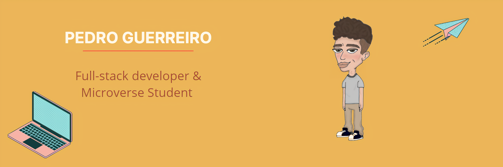

### Hello! I'm Pedro 👋

<!--
**guerreiropedr0/guerreiropedr0** is a ✨ _special_ ✨ repository because its `README.md` (this file) appears on your GitHub profile.

Here are some ideas to get you started:

- 🔭 I’m currently working on ...
- 🌱 I’m currently learning ...
- 👯 I’m looking to collaborate on ...
- 🤔 I’m looking for help with ...
- 💬 Ask me about ...
- 📫 How to reach me: ...
- 😄 Pronouns: ...
- ⚡ Fun fact: ...
-->

I'm a full-stack development student currently enrolled in Micorverse, an online software development school that uses pair-programming and real-world projects to teach development.
I learned HTML/CSS and JavaScript. I enjoy listening to music, play videogames and code. My goal this year is to finish Microverse program and land a job.

## 🌎 Find me around the web:

&nbsp;

